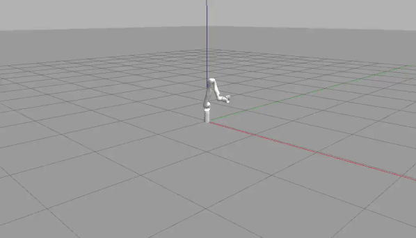

# Kinova Gen3 Arm: Pick and Place with ROS & MoveIt

This repository contains a ROS package for executing a "pick and place" task using a Kinova Gen3 robotic arm in the Gazebo simulator. The project demonstrates motion planning and robot control using the **MoveIt!** framework.

## Demo

The following GIF shows the Kinova arm successfully identifying a target object, planning a trajectory to it, picking it up, and placing it at a predefined goal location in a simulated environment.



## The Task

The `pick_and_place.py` script orchestrates the entire task by interfacing with MoveIt through its Python API. The core logic includes:

* **Scene Management**: Programmatically adding the target object and a collision-avoidance surface to the MoveIt planning scene.
* **Motion Planning**: Defining goal poses for the arm's end-effector (pre-grasp, grasp, pre-place, place).
* **Trajectory Execution**: Commanding the arm to follow the planned trajectories to execute the pick and place sequence.
* **Gripper Control**: Simulating the opening and closing of the gripper to pick up and release the object.

## Tech Stack

* **Framework**: ROS Noetic
* **Motion Planning**: MoveIt!
* **Simulation**: Gazebo
* **Language**: Python
* **Robot Model**: Kinova Gen3 Lite

## Setup and Installation

This project is a ROS package and must be built within a Catkin workspace. It depends on the official Kinova ROS packages.

**1. Prerequisites:**
* Ubuntu 20.04 with ROS Noetic installed.
* MoveIt! installed: `sudo apt install ros-noetic-moveit`

**2. Create a Catkin Workspace:**
```bash
mkdir -p ~/catkin_ws/src
cd ~/catkin_ws/src
```

**3. Install Kinova ROS Dependencies:**
Clone the official Kinova ROS repository into your workspace.
```bash
git clone https://github.com/Kinovarobotics/ros_kortex.git
```

**4. Add This Project:**
Clone this repository into your workspace.
```bash
git clone 
```

**5. Install Dependencies and Build:**
Navigate to the root of your workspace, install any remaining dependencies, and build the packages.
```bash
cd ~/catkin_ws
rosdep install --from-paths src --ignore-src -r -y
catkin_make
```

**6. Source the Workspace:**
Finally, source your workspace to make the packages available to ROS.
```bash
source devel/setup.bash
```

## How to Run

1.  **Launch the Simulation:**
    Open a terminal and launch the Gazebo simulation with the Kinova arm.
    ```bash
    roslaunch kortex_gazebo spawn_kortex_robot.launch
    ```

2.  **Run the Pick and Place Script:**
    Open a second terminal, source your workspace (`source ~/catkin_ws/devel/setup.bash`), and run the script.
    ```bash
    rosrun kinova_pick_and_place pick_and_place.py
    ```
The robot arm in Gazebo should then begin its pick and place sequence.

## License

This project is licensed under the **MIT License**.
